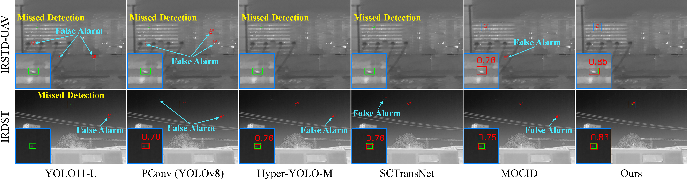

# TDCNet
Official repository of the AAAI 2026 paper "Spatio-Temporal Context Learning with Temporal Difference Convolution for Moving Infrared Small Target Detection".

## Spatio-Temporal Context Learning with Temporal Difference Convolution for Moving Infrared Small Target Detection  
Authors: Shukai Guo, Houzhang Fang, Qiuhuan Chen, Yi Chang; Luxin Yan

## Abstract

Moving infrared small target detection (IRSTD) plays a critical role in practical applications, such as surveillance of unmanned aerial vehicles (UAVs) and UAV-based search system. Moving IRSTD still remains highly challenging due to weak target features and complex background interference. Accurate spatio-temporal feature modeling is crucial for moving target detection, typically achieved through either temporal differences or spatio-temporal (3D) convolutions. Temporal difference can explicitly leverage motion cues but exhibits limited capability in extracting spatial features, whereas 3D convolution effectively represents spatio-temporal features yet lacks explicit awareness of motion dynamics along the temporal dimension. In this paper, we propose a novel moving IRSTD network (TDCNet), which effectively extracts and enhances spatio-temporal features for accurate target detection. Specifically, we introduce a novel temporal difference convolution (TDC) re-parameterization module that comprises three parallel TDC blocks designed to capture contextual dependencies across different temporal ranges. Each TDC block fuses temporal difference and 3D convolution into a unified spatio-temporal convolution representation. This re-parameterized module can effectively capture multi-scale motion contextual features while suppressing pseudo-motion clutter in complex backgrounds, significantly improving detection performance. Moreover, we propose a TDC-guided spatio-temporal attention mechanism that performs cross-attention between the spatio-temporal features extracted from the TDC-based backbone and a parallel 3D backbone. This mechanism models their global semantic dependencies to refine the current frame’s features, thereby guiding the model to focus more accurately on critical target regions. To facilitate comprehensive evaluation, we construct a new challenging benchmark, IRSTD-UAV, consisting of 15,106 real infrared images with diverse low signal-to-clutter ratio scenarios and complex backgrounds. Extensive experiments on IRSTD-UAV and public infrared datasets demonstrate that our TDCNet achieves state-of-the-art detection performance in moving target detection. 

## TDCNet Framework


## Visualization



Visual comparison of results from SOTA methods and TDCNet on the IRSTD-UAV and IRDST dataset. Boxes in green and red represent ground-truth and detected targets, respectively

## Environment

- [Python](https://www.python.org/)
- [PyTorch](https://pytorch.org/)
- [tqdm](https://github.com/tqdm/tqdm)
- [pycocotools](https://github.com/cocodataset/cocoapi)
- [OpenCV (cv2)](https://opencv.org/)
- [NumPy](https://numpy.org/)

## Data
1. Download the datasets.
   - [IRSTD-UAV](https://drive.google.com/file/d/17kgt2i09njcvjbtX3ivn884Lw6Ov2xb1/view)
   - [IRDST](https://xzbai.buaa.edu.cn/datasets.html)

2. Perform background alignment before training or testing.  
   You can use the [GIM](https://github.com/xuelunshen/gim) method for background alignment.

3. Organize the dataset structure as follows:
   ```
     IRSTD-UAV/
     ├── images/
     │ ├── 1/
     │ │ ├── 00000000.png
     │ │ ├── 00000001.png
     │ │ └── ...
     │ ├── 2/
     │ │ ├── 00000000.png
     │ │ ├── 00000001.png
     │ │ └── ...
     │ └── ...
     ├── labels/
     │ ├── 1/
     │ │ ├── 00000000.png
     │ │ ├── 00000001.png
     │ │ └── ...
     │ ├── 2/
     │ │ ├── 00000000.png
     │ │ ├── 00000001.png
     │ │ └── ...
     │ └── ...
     ├── matches/
     │ ├── 1/
     │ │ ├── 00000000/
     │ │ │ ├── match_1.png
     │ │ │ ├── match_2.png
     │ │ │ └── ...
     │ │ ├── 00000001/
     │ │ │ ├── match_1.png
     │ │ │ ├── match_2.png
     │ │ │ └── ...
     │ │ └── ...
     │ └── ...
     ├── train.txt
     ├── val.txt
     ├── train_coco.json
     └── val_coco.json
   ```
## How To Train

1. **Prepare the environment and dataset**
   - Configure environment variables:
     ```python
     os.environ["CUDA_VISIBLE_DEVICES"] = "0"
     ```
   - Set dataset paths in the script:
     ```python
     DATA_PATH = "/Dataset/IRSTD-UAV/"
     train_annotation_path = "/Dataset/IRSTD-UAV/train.txt"
     val_annotation_path = "/Dataset/IRSTD-UAV/val.txt"
     ```

2. **Training command**
   ```bash
   python train.py
   ```

## How To Test
```bash
python test.py
```

The testing results will be saved in the ./results folder.

## Citation
If you find our work useful for your research, please consider citing our paper:
```
@inproceedings{2026AAAI_TDCNet,
  title     = {Spatio-Temporal Context Learning with Temporal Difference Convolution for Moving Infrared Small Target Detection},
  author    = {Houzhang Fang and Shukai Guo and Qiuhuan Chen and Yi Chang and Luxin Yan},
  booktitle   = {Proceedings of the AAAI Conference on Artificial Intelligence},
  year      = {2026},
  pages     = { },
}
```

In additoin to the above paper, please also consider citing the following references. Thank you!
```
@inproceedings{2025CVPR_UniCD,
    title     = {Detection-Friendly Nonuniformity Correction: A Union Framework for Infrared {UAV} Target Detection},
    author    = {Houzhang Fang and Xiaolin Wang and Zengyang Li and Lu Wang and Qingshan Li and Yi Chang and Luxin Yan},
    booktitle = {IEEE/CVF Conference on Computer Vision and Pattern Recognition (CVPR)},
    year      = {2025},
    pages     = {11898-11907},
}
@ARTICLE{2023TII_DAGNet,
  title     =  {Differentiated Attention Guided Network Over Hierarchical and Aggregated Features for Intelligent {UAV} Surveillance},
  author    =  {Houzhang Fang and Zikai Liao and Xuhua Wang and Yi Chang and Luxin Yan},
  journal   =  {IEEE Transactions on Industrial Informatics}, 
  year      =  {2023},
  volume    =  {19},
  number    =  {9},
  pages     =  {9909-9920},
  }
@inproceedings{2023ACMMM_DANet,
title       =  {{DANet}: Multi-scale {UAV} Target Detection with Dynamic Feature Perception and Scale-aware Knowledge Distillation},
author      =  {Houzhang Fang and Zikai Liao and Lu Wang and Qingshan Li and Yi Chang and Luxin Yan and Xuhua Wang},
booktitle   =  {Proceedings of the 31st ACM International Conference on Multimedia (ACMMM)},
pages       =  {2121-2130},
year        =  {2023},
}
@article{2024TGRS_SCINet,
  title     = {{SCINet}: Spatial and Contrast Interactive Super-Resolution Assisted Infrared {UAV} Target Detection},
  author    = {Houzhang Fang and Lan Ding and Xiaolin Wang and Yi Chang and Luxin Yan and Li Liu and Jinrui Fang},
  journal   = {IEEE Transactions on Geoscience and Remote Sensing},
  volume    = {62},
  year      = {2024},
  pages     = {1-22},
}
@ARTICLE{2022TIMFang,
  title     =  {Infrared Small {UAV} Target Detection Based on Depthwise Separable Residual Dense Network and Multiscale Feature Fusion},
  author    =  {Houzhang Fang and Lan Ding and Liming Wang and Yi Chang and Luxin Yan and Jinhui Han},
  journal   =  {IEEE Transactions on Instrumentation and Measurement}, 
  year      =  {2022},
  volume    =  {71},
  number    =  {},
  pages     =  {1-20},
}
```

## Contact
If you have any question, please contact: houzhangfang@xidian.edu.cn,

Copyright &copy; Xidian University.

## Acknowledgments
Some of the code is based on [STMENet](https://github.com/UESTC-nnLab/STME). Thanks for their excellent work!

## License
MIT License. This code is only freely available for non-commercial research use.

